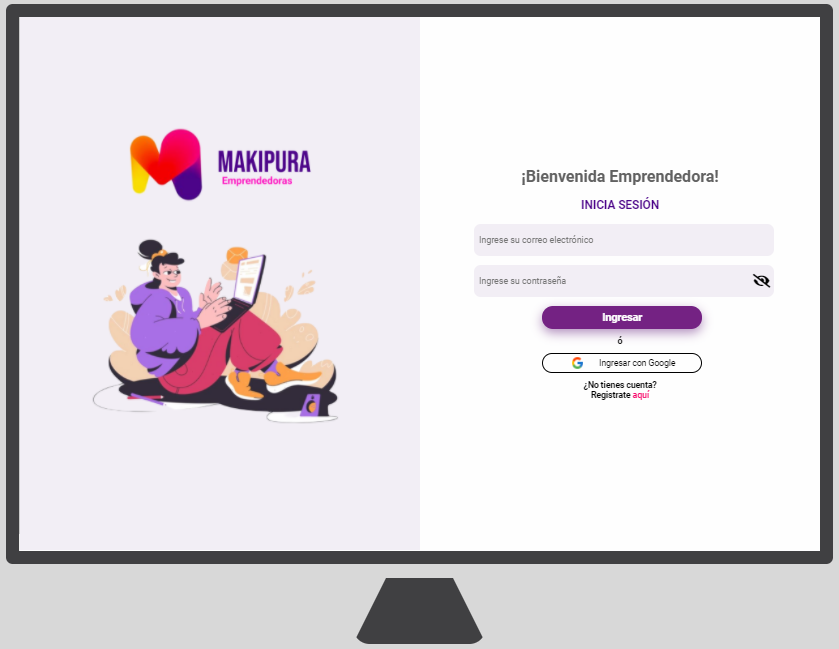
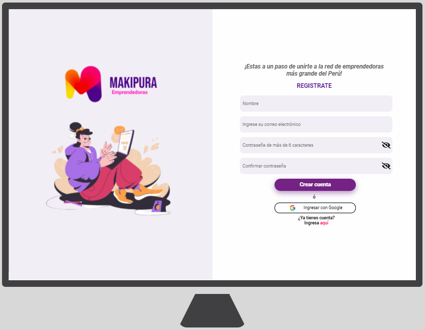

# Creando una Red Social

## Índice

* [1. Preámbulo](#1-preámbulo)
* [2. Acerca de Makipura](#2-Acerca-de-Makipura)
* [3. Historias de usuario](#3-Historias-de-usuario)
* [4. Prototipo de baja fidelidad](#4-Prototipo-de-baja-fidelidad)
* [5. Prototipo de alta fidelidad](#5-Prototipo-de-alta-fidelidad)
* [6. Test de usabilidad](#6-Test-de-usabilidad)
* [7. Producto final](#7-Producto-final)
* [8. Colaboradoras](#8-Colaboradoras)

***

## 1. Preámbulo

Instagram, Snapchat, Twitter, Facebook, Twitch, Linkedin, etc. Las redes
sociales han invadido nuestras vidas. Las amamos u odiamos, y muchos no podemos
vivir sin ellas.

Hay redes sociales de todo tipo y para todo tipo de intereses. Por ejemplo,
en una ronda de financiamiento con inversionistas, se presentó una red social
para químicos en la que los usuarios podían publicar artículos sobre sus
investigaciones, comentar en los artículos de sus colegas, y filtrar artículos
de acuerdo a determinadas etiquetas o su popularidad, lo más reciente, o lo
más comentado.

## 2. Acerca de Makipura

MAKIPURA es una red social creada para mujeres emprendedoras localizadas en Perú que tiene por objetivo conectarlas con la finalidad de resolver dudas, compartir información, experiencias, den like a las publicaciones de los demás emprendedoras de la comunidad.
Si estas buscando una plataforma de interación y generar vinculos positivos de ayuda mutua  entre emprendedoras, regístrate y entra ya a makipura.

- **Definición de producto**

## 3. Historias de usuario

## 4. Prototipo de baja fidelidad

## 5. Prototipo de alta fidelidad

## 6. Test de usabilidad

### Usuario 1

- Me fue fácil registrarme y loguearme.
- La sección de publicaciones es muy básico y me gustaria que sea más dinámico donde pudiera incluir emoticones y subir imagenes.
- En la vista Desktop del home tenía espacios vacios.
- Hacer modificaciones al post (publicar, editar, guardar y eliminar) fue muy practico y fácil de usar.
- Me gusto la paleta de colores.
- El texto que redirige de login a register y viceversa nose aprecia facilmente.

### Usuario 2

- No me fue díficil registrarmme pero me parecio un poco tedioso que haya dos formas de loguearme.
- El diseño me pareció practico y los avisos me ayudaron a mi registro.
- El modal de verificación de correo me generó seguridad y confianza.
- Recomiendo incluir una imagen de emprendedoras en el home.
- El texto que redirige de login a register y viceversa nose aprecia facilmente.
## 7. Producto final

- Login

- Registro

## 8. Colaboradoras

Este proyecto fue realizado por:

 - [Natalia Espinoza Barrientos](https://github.com/NINOSKA2000)

 - [Elizabeth Lopez Valerin](https://github.com/eliza8855)

 - [Ana Marlene Orihuela Ramirez](https://github.com/ana446)
 