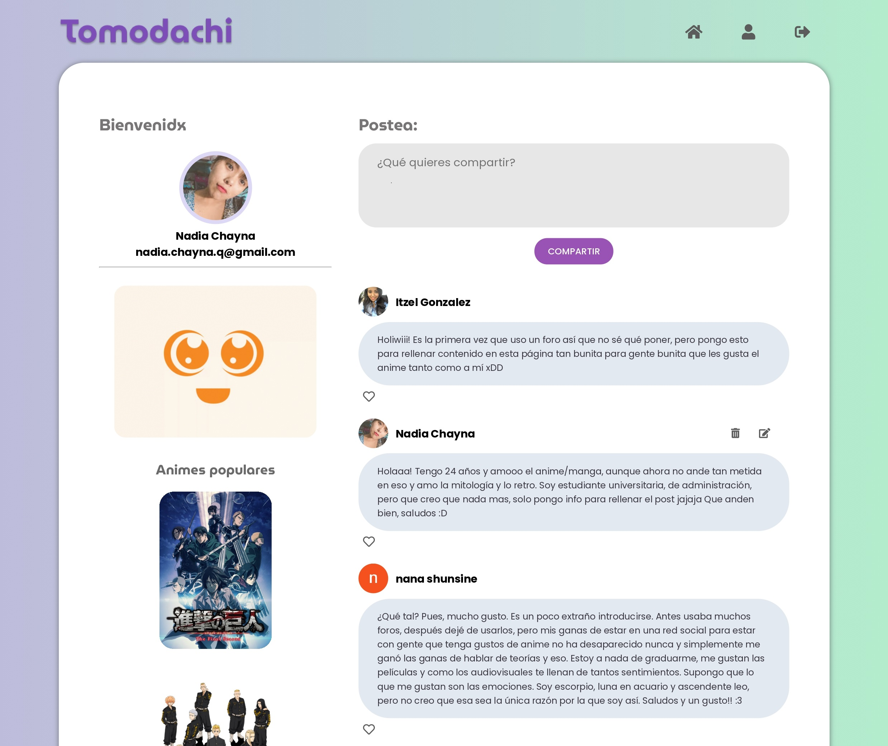

# ✨ Tomodachi ✨

## 1. Preámbulo

Instagram, Snapchat, Twitter, Facebook, Twitch, Linkedin, etc. Las redes
sociales han invadido nuestras vidas. Las amamos u odiamos, y muchos no podemos
vivir sin ellas.

## 2. Resumen del proyecto

El proyecto Tomodachi es denominado una red social inspirado por la **expresión cultural del anime** para todos sus seguidores, en el cual puedan desarrollar un espacio de amena interacción entre sus miembros, a través de la creación de una cuenta por medio de la plataforma web y/o google, y en las cuales se invita a la creación, edición y eliminar publicaciones.

## 3. Objetivos de aprendizaje

### HTML

- [x] **Uso de HTML semántico**

### CSS

- [x] **Uso de selectores de CSS**
- [x] **Modelo de caja (box model): borde, margen, padding**
- [x] **Uso de flexbox en CSS**
- [x] **Uso de CSS Grid Layout**

### Web APIs

- [x] **Uso de selectores del DOM**
- [x] **Manejo de eventos del DOM (listeners, propagación, delegación)**
- [x] **Manipulación dinámica del DOM**
- [x] **Ruteado (History API, evento hashchange, window.location)**

### JavaScript

- [ ] **Arrays (arreglos)**
- [x] **Objetos (key, value)**
- [x] **Diferenciar entre tipos de datos primitivos y no primitivos**
- [x] **Variables (declaración, asignación, ámbito)**
- [x] **Uso de condicionales (if-else, switch, operador ternario, lógica booleana)**
- [x] **Uso de bucles/ciclos (while, for, for..of)**
- [x] **Funciones (params, args, return)**
- [x] **Pruebas unitarias (unit tests)**
- [ ] **Pruebas asíncronas**
- [x] **Uso de mocks**
- [x] **Módulos de ECMAScript (ES Modules)**
- [x] **Uso de linter (ESLINT)**
- [x] **Uso de identificadores descriptivos (Nomenclatura y Semántica)**
- [x] **Diferenciar entre expresiones (expressions) y sentencias (statements)**
- [x] **Promesas**

### Control de Versiones (Git y GitHub)

- [x] **Git: Instalación y configuración**
- [x] **Git: Control de versiones con git (init, clone, add, commit, status, push, pull, remote)**
- [x] **Git: Integración de cambios entre ramas (branch, checkout, merge, reset)**
- [x] **GitHub: Creación de cuenta y repos, configuración de llaves SSH**
- [x] **GitHub: Despliegue con GitHub Pages**
- [x] **GitHub: Colaboración en Github (branches | forks | pull requests | code review | tags)**
- [x] **GitHub: Organización en Github (projects | issues | labels | milestones | releases)**

### UX (User eXperience)

- [x] **Diseñar la aplicación pensando en y entendiendo al usuario**
- [x] **Crear prototipos para obtener feedback e iterar**
- [x] **Aplicar los principios de diseño visual (contraste, alineación, jerarquía)**
- [x] **Planear y ejecutar tests de usabilidad**

### Firebase

- [x] **Firebase Auth**
- [x] **Firestore**

## 4. Criterios de aceptación del proyecto

### 4.1 Definición del producto

**¿Quiénes son los principales usuarios de producto?**
* Nuestro principales usuarios son seguidores de anime/manga, también denominados `"Otakus"`.

**¿Qué problema resuelve el producto?**
* Investigamos que existen plataformas de streaming, grupos en otras redes sociales, pero no hay una red social exclusiva para esta comunidad en va en constante creicimiento e integra a miles de jóvenes entre los 15 y 28 años en el mundo.

### 4.2 Historias de usuario

### 5. Diseño de la Interfaz de Usuario (prototipo de baja fidelidad)

   

### 6. Responsive

* Vista mobile

    
    

* Vista Desktop
    
    
    
  